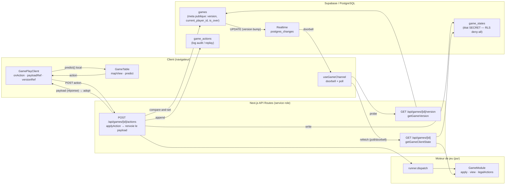
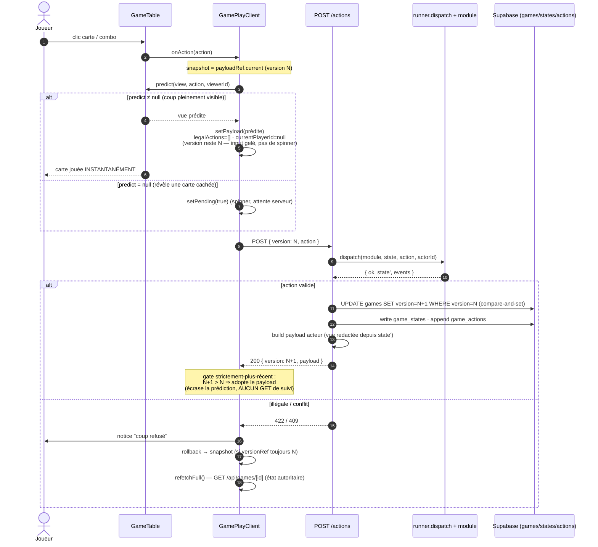
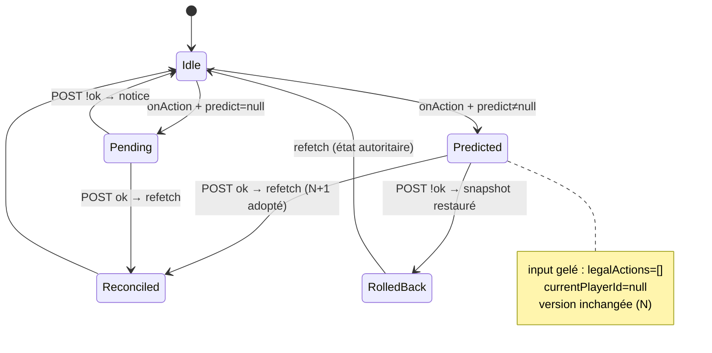
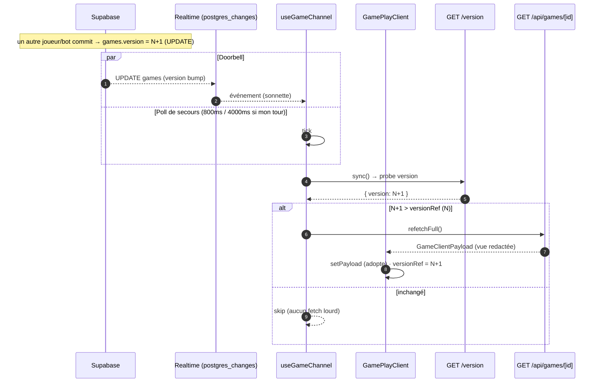
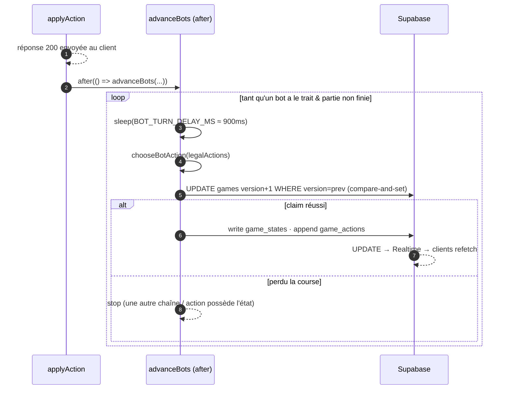

# Wildcard — Architecture des échanges en partie

Ce document décrit le **flux d'échange réseau pendant une partie** : comment une
action joueur est jouée, validée, synchronisée entre clients, et comment l'UI
réagit instantanément (optimistic UI) tout en restant **server-authoritative**.

> Les schémas sont en [Mermaid](https://mermaid.js.org/) — rendus nativement par
> GitHub, GitLab et la plupart des éditeurs Markdown.

---

## 1. Vue d'ensemble — acteurs & responsabilités

**Principes clés**

- Le client ne reçoit **jamais** l'état brut : seulement la projection
  `view()` redactée (les mains adverses deviennent des compteurs). `game_states`
  est en RLS deny-all, accessible uniquement via service-role côté serveur.
- Toute mutation passe par `POST /actions` → `applyAction` (jamais d'écriture
  directe depuis le client).
- `games` (méta publique) et `game_states` (secret) sont **séparés** : le poll
  chaud lit la méta, jamais le secret.

---

## 2. Action joueur — optimistic UI + réconciliation

Le cas central : le joueur joue une carte. L'UI applique le coup
**immédiatement** (`predict`), puis le serveur fait foi.

> **1 aller-retour par coup.** `applyAction` détient déjà l'état committé : il
> renvoie le payload redacté de l'acteur dans la réponse POST. Le client
> l'adopte directement — plus de `GET` de suivi (avant : POST **puis** GET = 2
> aller-retours + 2 chargements d'état). Le `GET` complet ne sert plus qu'au
> chemin poll/doorbell (coups des autres).

**Pourquoi la version reste à N pendant le vol**

La vue optimiste garde `version = N`. Donc :

- un **probe de poll** en vol renvoie `N` (serveur pas encore committé) →
  `N ≤ N` → ignoré, la prédiction n'est pas écrasée ;
- au retour serveur, `refetchFull` voit `N+1 > N` → adopte la vue autoritaire ;
- sur **rejet**, rollback au snapshot seulement si `versionRef === N` (rien de
  plus récent n'a atterri entre-temps).

---

## 3. Cycle de vie d'un coup optimiste (état client)

---

## 4. Coup adverse / bot — synchronisation par poll à deux étages

Quand un **autre** joueur (ou un bot) agit, le client l'apprend par le doorbell
Realtime ou le poll, puis ne télécharge le gros payload que si la version a
réellement avancé.

**Deux étages — pourquoi**

- `GET /version` lit une seule ligne méta indexée (`games`) → quelques octets,
  pas de secret, pas de `view()`. Pollable à la cadence des bots sans coût.
- `GET /api/games/[id]` (payload complet redacté) **uniquement** quand
  `version` a avancé.
- `postgres_changes` n'est pas fiable sur la stack self-hosted → le poll est le
  canal dépendable ; le doorbell ne fait qu'accélérer.

---

## 5. Chaîne de bots (après réponse)

Après une action humaine, les bots qui ont le trait jouent **après la réponse
HTTP** (`after()`), un coup à la fois, chacun bumpant `version` → chaque coup
arrive comme sa propre mise à jour Realtime (turns visibles, pas un burst).

> Self-heal : une chaîne `after()` peut mourir (invocation serverless tuée,
> restart). Chaque lecture (`getGameVersion` / `getGameClientState`) re-kicke la
> chaîne si un bot a le trait et que la ligne est restée intouchée au-delà de
> `STALL_RESUME_MS`.

---

## 6. Garanties transverses

| Garantie | Mécanisme |
|----------|-----------|
| **Server-authoritative** | toute action validée par `module.apply` côté serveur ; coup illégal refusé (422), jamais joué sur confiance client |
| **Anti-double-coup / anti-stale** | concurrence optimiste : `POST` envoie `version`, `applyAction` fait un compare-and-set sur `games.version` (loser → 409) |
| **Confidentialité (RLS en code)** | `view()` redacte les mains adverses ; `game_states` en RLS deny-all (service-role only) |
| **Déterminisme / replay** | RNG seedé dans le `state` ; `game_actions` rejoue toute partie depuis `(seed, log)` |
| **UX instantanée** | `predict()` applique le coup localement ; le serveur réconcilie via le gate strictement-plus-récent ; rollback sur rejet |
| **1 aller-retour / coup** | `applyAction` renvoie le payload redacté dans la réponse POST → le client l'adopte sans `GET` de suivi (avant : POST + GET) |
| **Poll bon marché** | deux étages : probe `version` (méta) → payload complet seulement si bump |

Détails d'implémentation : `src/components/game/GamePlayClient.tsx`,
`src/lib/realtime/useGameChannel.ts`, `src/lib/models/game.ts`,
`src/lib/games/table/types.ts` (contrat `predict`), `src/lib/engine/runner.ts`.
